[](https://classroom.github.com/a/QDgjoMxG)
# MiniTorch Module 1

Welcome to Module 1 of MiniTorch! This assignment introduces you to automatic differentiation and scalar computation, the fundamental building blocks of neural network training.

## Learning Objectives

In this assignment, you will:

- **Implement automatic differentiation** using computational graphs and backpropagation
- **Build scalar computation systems** that track gradients through mathematical operations
- **Create differentiable functions** that support both forward and backward passes
- **Understand gradient-based optimization** by implementing the computational foundation for machine learning

## Getting Started

### Prerequisites

Before beginning this assignment, please complete the environment setup:

1. **Review the installation guide**: Follow the detailed instructions in [`installation.md`](installation.md) to configure your development environment.
2. **Sync previous module files**: Run the sync script to get required files from Module 0:
   ```bash
   python sync_previous_module.py <path-to-module-0> <path-to-current-module>
   ```
   Example:
   ```bash
   python sync_previous_module.py assignments/Module-0 assignments/Module-1
   ```
   Replace `<path-to-module-0>` with the path to your Module 0 directory and `<path-to-current-module>` with `.` (current directory) or the path to your Module 1 directory.
3. **Verify your setup**: Ensure all dependencies are properly installed and your environment is working correctly. If you need help ask your TAs on Ed Discussion.

### Assignment Overview

This module focuses on implementing automatic differentiation for scalar values. You'll build the computational graph infrastructure that enables neural networks to compute gradients automatically, forming the mathematical foundation for training machine learning models.

## Tasks and Resources

### Required Reading

Start by reviewing the module guide:
- **Module Overview**: [https://minitorch.github.io/module1/module1/](https://minitorch.github.io/module1/module1/)

### Implementation Tasks

Follow the guides listed in the module documentation to complete each task systematically. Each task builds upon the previous one, so complete them in order.

* **Task 1.1: Numerical Derivatives and Central Difference**
  - Files to modify: `minitorch/autodiff.py`

* **Task 1.2: Scalars**
  - Files to modify: `minitorch/scalar.py`, `minitorch/scalar_functions.py`

* **Task 1.3: Chain Rule**
  - Files to modify: `minitorch/scalar.py`

* **Task 1.4: Backpropagation**
  - Files to modify: `minitorch/autodiff.py`, `minitorch/scalar_functions.py`

* **Task 1.5: Training**
  - Files to examine: `project/run_scalar.py`, `project/interface/train.py`

For detailed testing instructions, see [`testing.md`](testing.md)

### Task 1.5 Deliverables
Add the required training logs and visualizations here, along with the hyperparameters you used. Please include your results for all four datasets: simple, diagonal, split, and XOR.

```
# TODO: Add Task 1.5 deliverables here
```
| Dataset  | Hyperparameters (learning rate, epochs, hidden layer) | Accuracy | Final Loss |
| -------- | ----------------------------------------------- | -------- | ---------- |
| Simple (50 points)   | lr=0.1, epochs=300, hidden=4        | 0.98     | 4.78       |
| Diagonal (100 points)| lr=0.05, epochs=500, hidden=8       | 0.92     | 9.07       |
| Split (50 points)    | lr=0.05, epochs=500, hidden=10      | 0.96     | 12.07      |
| XOR (100 points)     | lr=0.1, epochs=500, hidden=20       | 0.94     | 17.58      |

#### Visualizations
- Simple dataset:
<p float="left">
  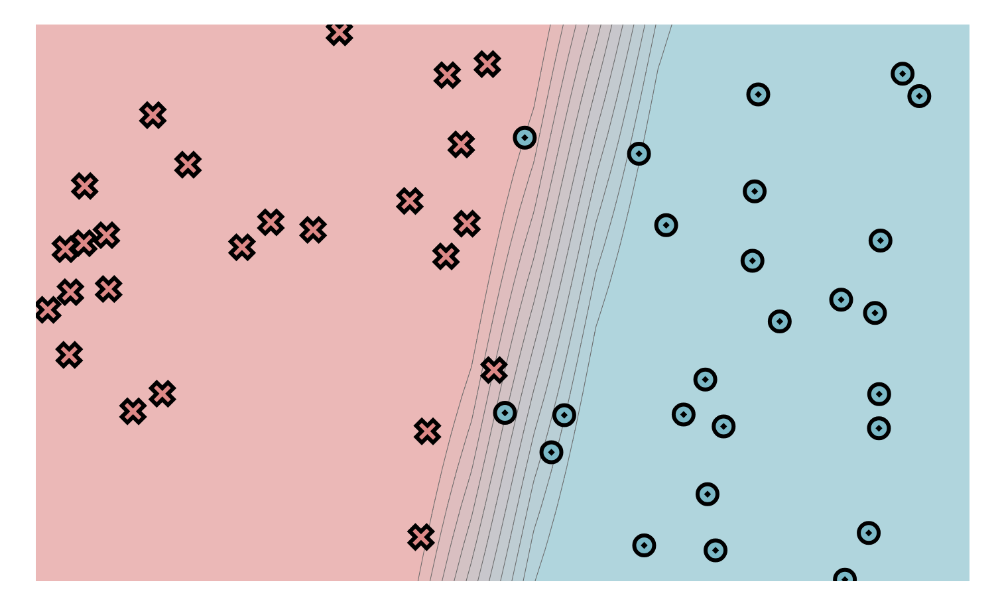
  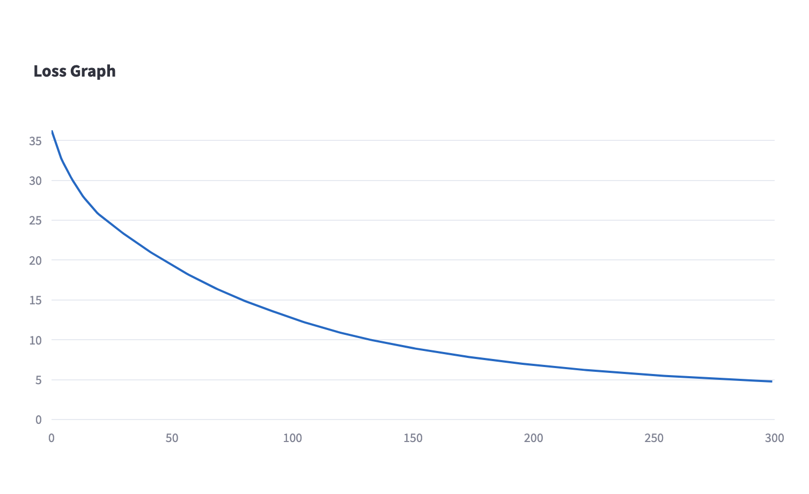
  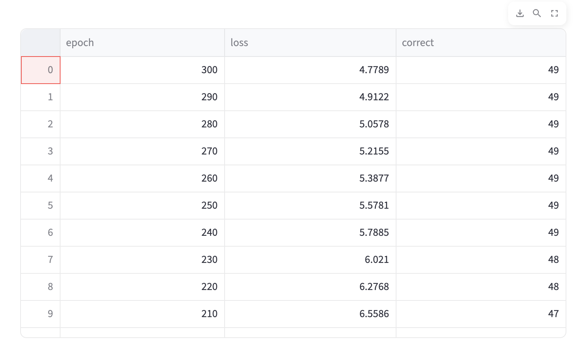
</p>

- Diagonal dataset:
<p float="left">
  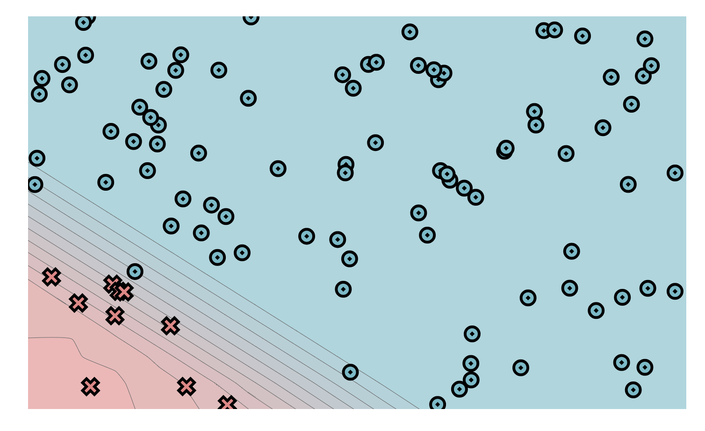
  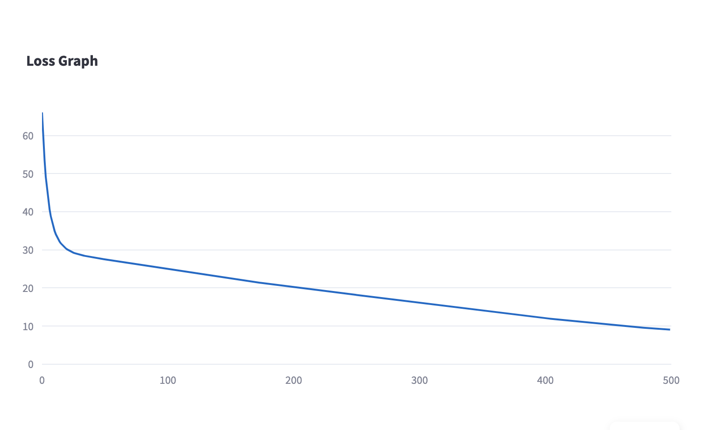
  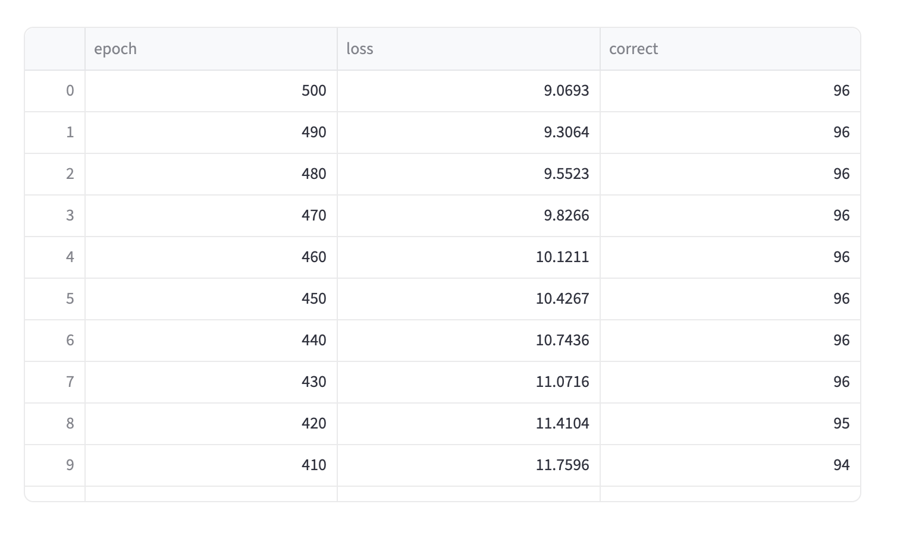
</p>

- Split dataset:
<p float="left">
  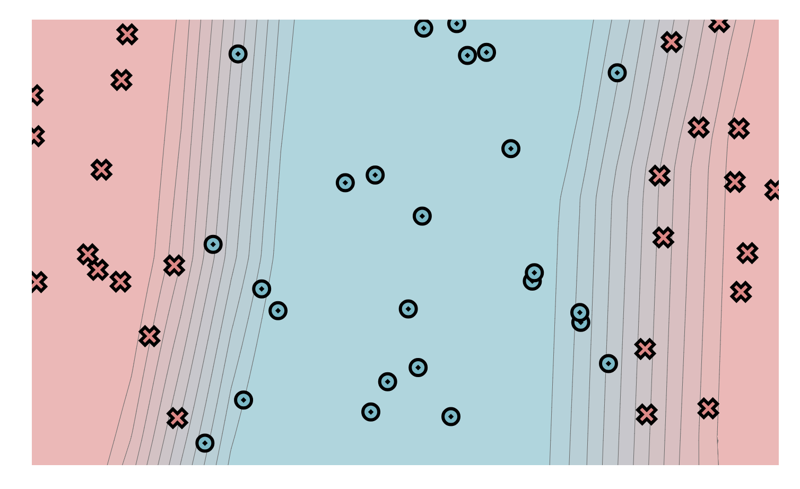
  
  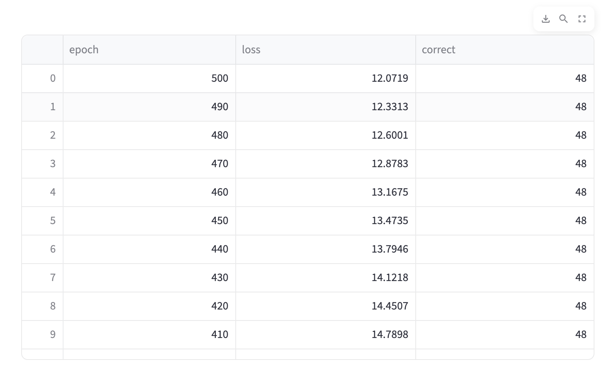
</p>

- XOR dataset:
<p float="left">
  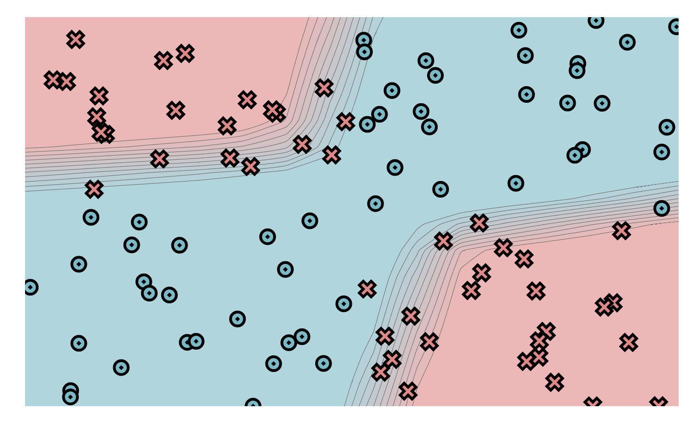
  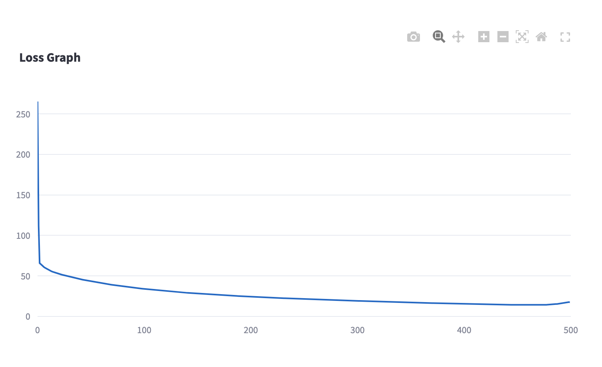
  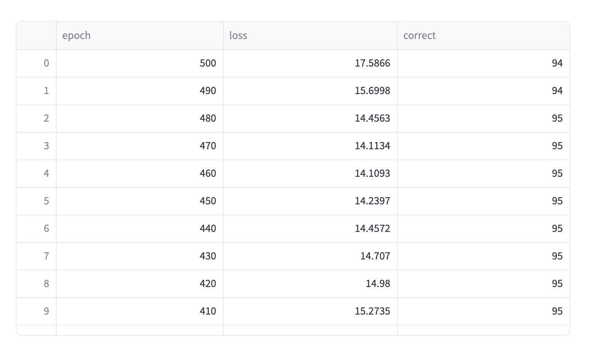
</p>


### Submission Instructions

1. **Commit Your Changes**: Make sure all your changes are committed to your repository.
2. **Push to GitHub**: Push your changes to your GitHub repository.
3. **Autograder**: Once you have pushed your changes, the autograder will automatically run and provide feedback on your submission. Check the GitHub Actions tab for the results.
4. **Resubmit if Necessary**: If you need to make changes based on the feedback, make your edits, commit them, and push again. The autograder will re-run with your new changes.

### Troubleshooting

If you encounter issues during the submission process, consider the following steps:

- **Check the Logs**: Review the logs in the GitHub Actions tab for any error messages or warnings.
- **Check Instruction in Code**: Make sure you followed all instructions in the code comments and documentation.
- **Ask for Help**: If you're stuck, don't hesitate to reach out to your TAs on Ed Discussion.

## Files Synced from Previous Module

The following files are synced from Module 0:
- `minitorch/operators.py`
- `minitorch/module.py`
- `tests/test_module.py`
- `tests/test_operators.py`
- `project/run_manual.py`

## Allowed Libraries

The following libraries are allowed for use in this assignment:

```
math
```

Note: the `numpy` library is used by project code in `scalar.py`, but you will not need it elsewhere to complete this module.
