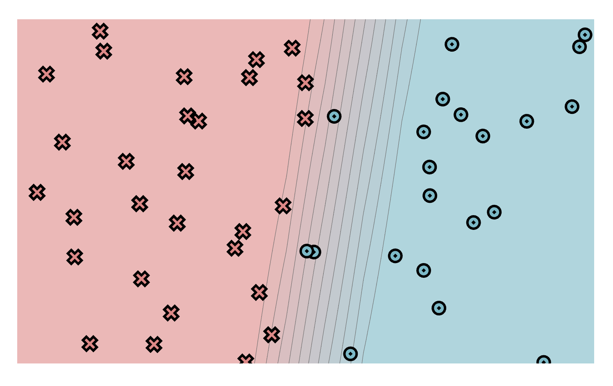
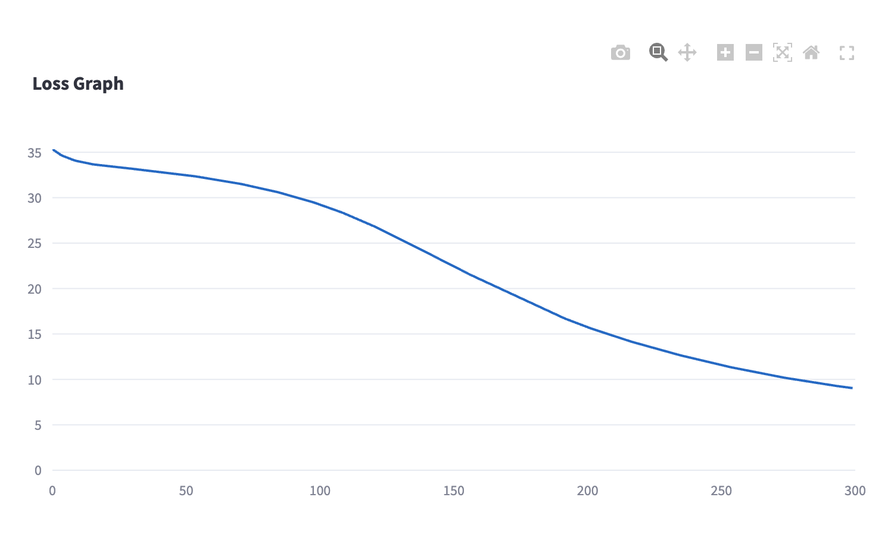
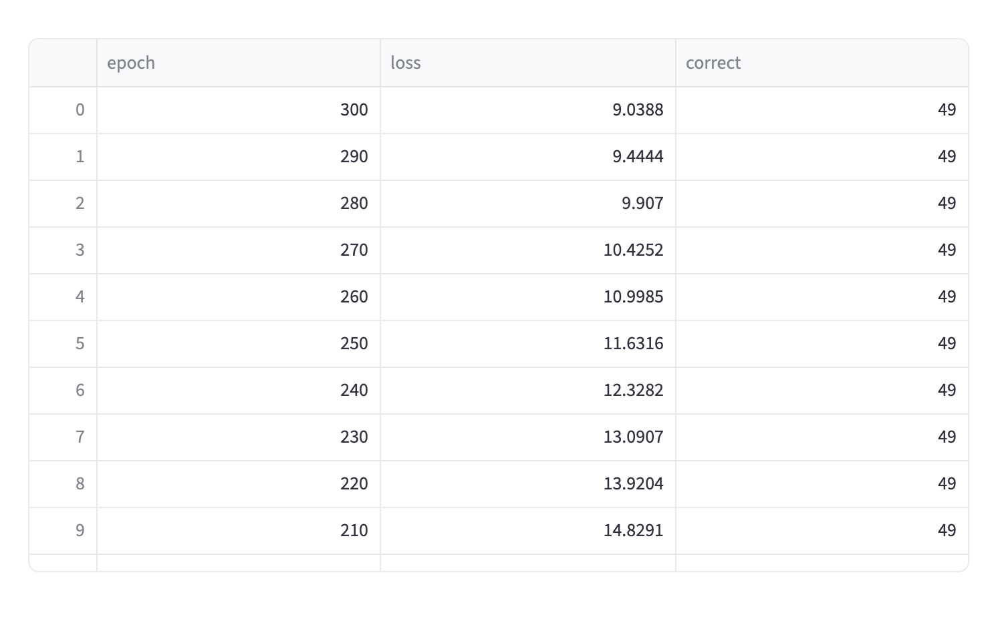
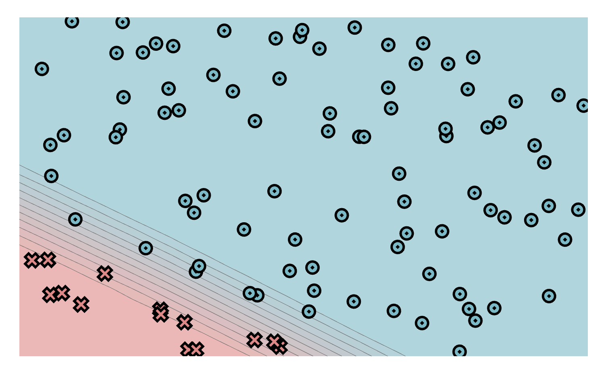
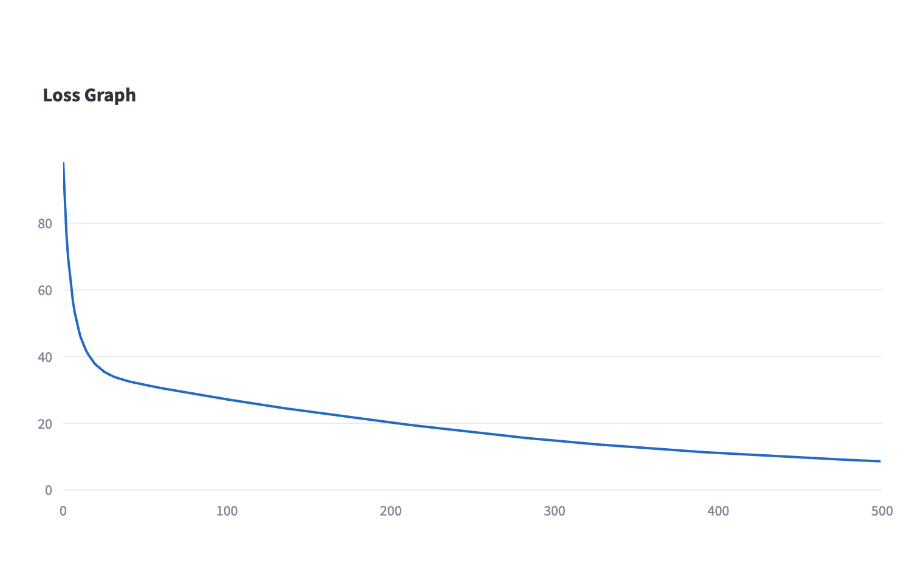
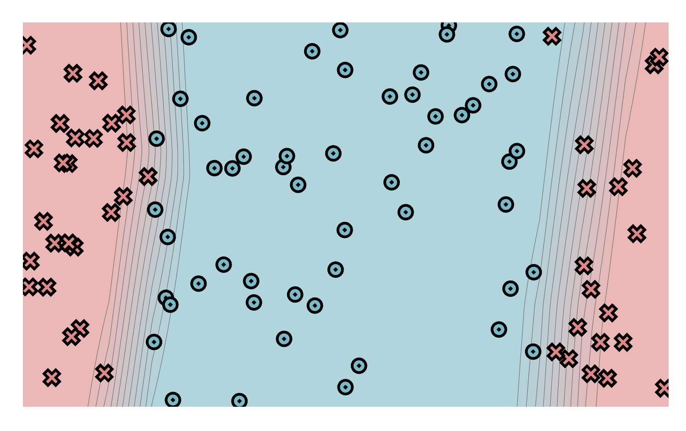
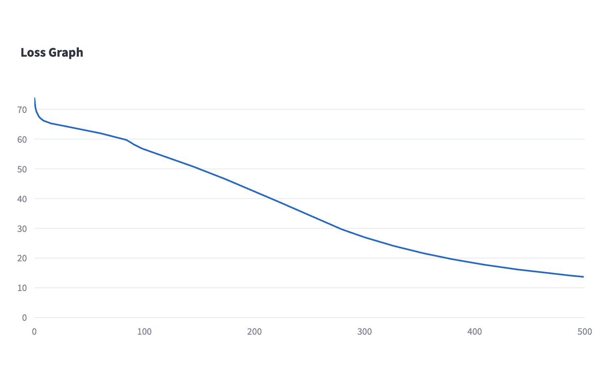
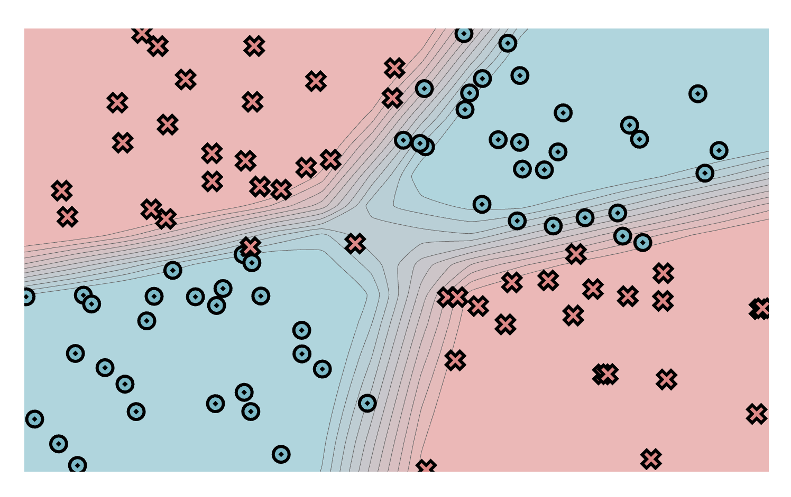
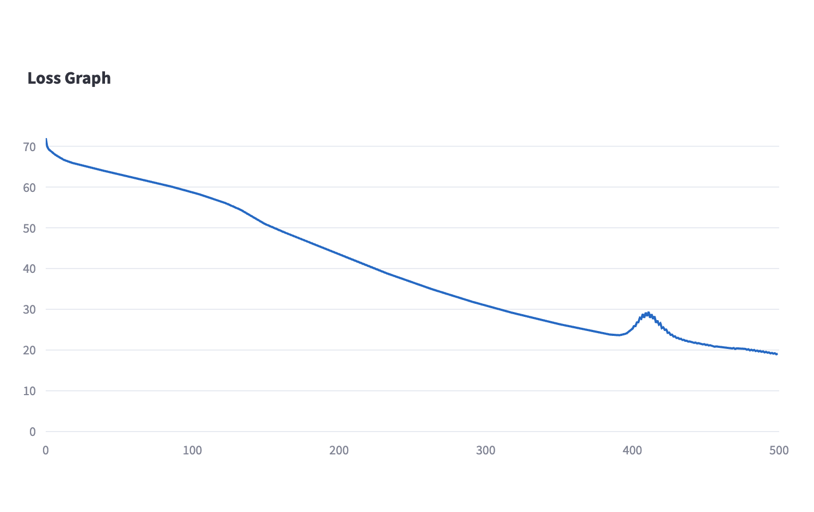
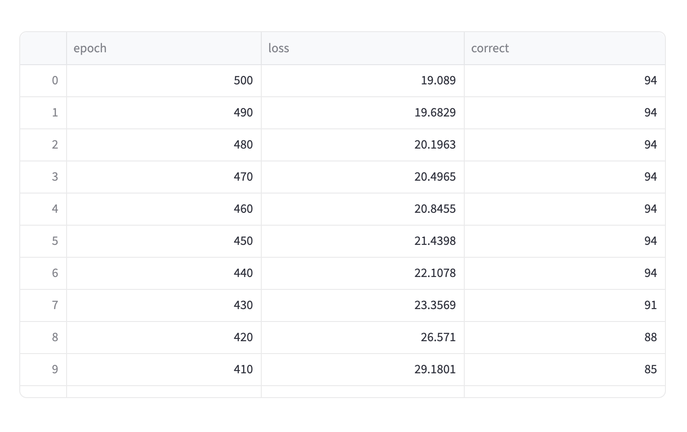

[](https://classroom.github.com/a/ZF4v4FfT)
# MiniTorch Module 2


**Tensors** - Extending Autodifferentiation to Multidimensional Arrays

* Docs: https://minitorch.github.io/
* Overview: https://minitorch.github.io/module2/module2/

## Overview

Module 2 introduces **Tensors** - multidimensional arrays that extend the scalar autodifferentiation system from Module 1. While the scalar system is correct, it's inefficient due to Python overhead. Tensors solve this by grouping operations together and enabling faster implementations.

## Installation

✅ See [installation.md](installation.md) for detailed setup instructions.

## Quick Start

```bash
# Install dependencies
pip install -e ".[dev,extra]"

# Sync files from Module 1
python sync_previous_module.py ../Module-1 .

# Verify installation
python -c "import minitorch; print('Success!')"

# Run tests
pytest -m task2_1  # Tensor data and indexing
pytest -m task2_2  # Tensor broadcasting
pytest -m task2_3  # Tensor operations
pytest -m task2_4  # Tensor autodifferentiation

# Train tensor-based model
python project/run_tensor.py
```

## Tasks

### Task 2.1: Tensor Data - Indexing
**File to Edit**: `minitorch/tensor_data.py`

### Task 2.2: Tensor Broadcasting
**File to Edit**: `minitorch/tensor_data.py`

### Task 2.3: Tensor Operations
**Files to Edit**: `minitorch/tensor_ops.py`, `minitorch/tensor_functions.py`

### Task 2.4: Extend autodifferentiation to work with tensors and broadcasting
**Files to Edit**: `minitorch/tensor_functions.py`

### Task 2.5: Tensor-Based Neural Network Training
**File to Edit**: `project/run_tensor.py`

**Requirements**:
- Train on the first **four datasets** and record results in README
- Record time per epoch for performance comparison
- Should match functionality of `project/run_scalar.py` but use tensor operations
- To run streamlit, use:
```bash
streamlit run project/app.py -- 2
```

| Dataset  | Hyperparameters (learning rate, epochs, hidden layer) | Accuracy | Final Loss | Time per Epoch |
| -------- | ----------------------------------------------- | -------- | ---------- | -----------|
| Simple (50 points)   | lr=0.1, epochs=300, hidden=4        | 0.98     | 9.04       | 0.112s     |
| Diagonal (100 points)| lr=0.05, epochs=500, hidden=8       | 1.00     | 8.61       | 0.518s     |
| Split (100 points)   | lr=0.1, epochs=500, hidden=10       | 0.98     | 13.68      | 0.502s     |
| XOR (100 points)     | lr=0.1, epochs=500, hidden=20       | 0.94     | 19.08      | 1.552s     |

#### Visualizations
- Simple dataset:
<p float="left">
  
  
  
</p>

- Diagonal dataset:
<p float="left">
  
  
  
</p>

- Split dataset:
<p float="left">
  
  
  
</p>

- XOR dataset:
<p float="left">
  
  
  
</p>


## Testing

See [testing.md](testing.md) for detailed testing instructions.

## Files

This assignment requires the following files from Module 1. You can get these by running:

```bash
python sync_previous_module.py ../Module-1 .
```

The files that will be synced are:

- `minitorch/operators.py`
- `minitorch/module.py`
- `minitorch/autodiff.py`
- `minitorch/scalar.py`
- `project/run_manual.py`
- `project/run_scalar.py`