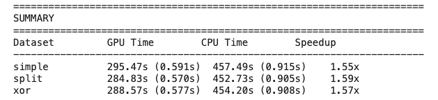
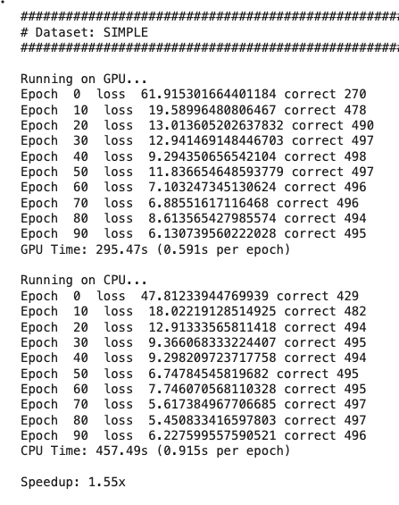
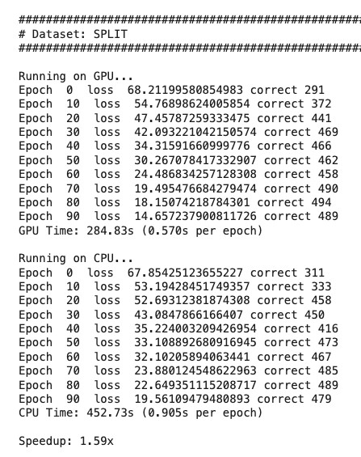
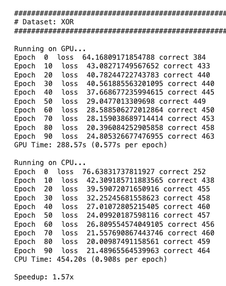
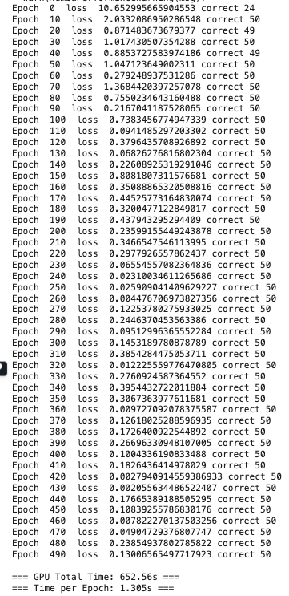
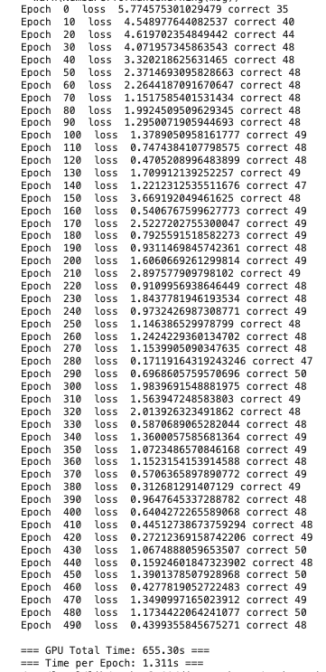
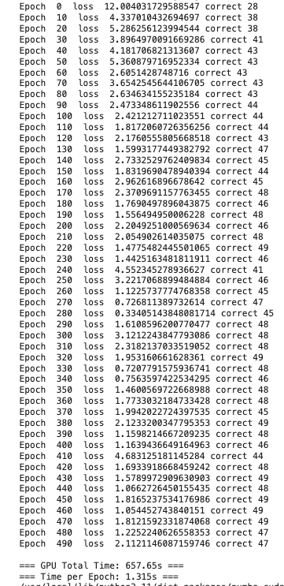

[](https://classroom.github.com/a/Dh3vDsCF)
# MiniTorch Module 3 - Parallel and GPU Acceleration


**Documentation:** https://minitorch.github.io/

**Overview (Required reading):** https://minitorch.github.io/module3/module3/

## Overview

Module 3 focuses on **optimizing tensor operations** through parallel computing and GPU acceleration. You'll implement CPU parallel operations using Numba and GPU kernels using CUDA, achieving dramatic performance improvements over the sequential tensor backend from Module 2.

### Key Learning Goals
- **CPU Parallelization**: Implement parallel tensor operations with Numba
- **GPU Programming**: Write CUDA kernels for tensor operations
- **Performance Optimization**: Achieve significant speedup through hardware acceleration
- **Matrix Multiplication**: Optimize the most computationally intensive operations with operator fusion

## Tasks Overview

**Task 3.1**: CPU Parallel Operations
File to edit: `minitorch/fast_ops.py`
Feel free to use numpy functions like `np.array_equal()` and `np.zeros()`.

**Task 3.2**: CPU Matrix Multiplication
File to edit: `minitorch/fast_ops.py`
Implement optimized batched matrix multiplication with parallel outer loops.

**Task 3.3**: GPU Operations (requires GPU)
File to edit: `minitorch/cuda_ops.py`
Implement CUDA kernels for tensor map, zip, and reduce operations.

**Task 3.4**: GPU Matrix Multiplication (requires GPU)
File to edit: `minitorch/cuda_ops.py`
Implement CUDA matrix multiplication with shared memory optimization for maximum performance.

**Task 3.5**: Training (requires GPU)
File to edit: `project/run_fast_tensor.py`
Implement missing functions and train models on all datasets to demonstrate performance improvements.

## Documentation

- ✅ **[Installation Guide](installation.md)** - Setup instructions including GPU configuration
- **[Testing Guide](testing.md)** - How to run tests locally and handle GPU requirements

## GPU Setup

Follow this [link](https://colab.research.google.com/drive/1gyUFUrCXdlIBz9DYItH9YN3gQ2DvUMsI?usp=sharing). Go to the Colab file → save to drive, select runtime to T4 and follow instructions.

## Development Tools
## Code Quality
```bash
# Automatic style checking
pre-commit install
git commit -m "your changes"  # Runs style checks automatically

# Manual style checks
ruff check .      # Linting
ruff format .     # Formatting
pyright .         # Type checking
```

### Debugging
```bash
# Debug Numba JIT issues
NUMBA_DISABLE_JIT=1 pytest -m task3_1 -v

# Debug CUDA kernels
NUMBA_CUDA_DEBUG=1 pytest -m task3_3 -v

# Monitor GPU usage
nvidia-smi -l 1  # Update every second
```

### Training Commands

#### Local Environment
```bash
# CPU Backend
python project/run_fast_tensor.py --BACKEND cpu --HIDDEN 100 --DATASET simple --RATE 0.05
python project/run_fast_tensor.py --BACKEND cpu --HIDDEN 100 --DATASET split --RATE 0.05
python project/run_fast_tensor.py --BACKEND cpu --HIDDEN 100 --DATASET xor --RATE 0.05

# GPU Backend
python project/run_fast_tensor.py --BACKEND gpu --HIDDEN 100 --DATASET simple --RATE 0.05
python project/run_fast_tensor.py --BACKEND gpu --HIDDEN 100 --DATASET split --RATE 0.05
python project/run_fast_tensor.py --BACKEND gpu --HIDDEN 100 --DATASET xor --RATE 0.05
```

#### Google Colab (Recommended)
```bash
# GPU Backend examples
!cd $DIR; PYTHONPATH=/content/$DIR python3.11 project/run_fast_tensor.py --BACKEND gpu --HIDDEN 100 --DATASET simple --RATE 0.05
!cd $DIR; PYTHONPATH=/content/$DIR python3.11 project/run_fast_tensor.py --BACKEND gpu --HIDDEN 100 --DATASET split --RATE 0.05
!cd $DIR; PYTHONPATH=/content/$DIR python3.11 project/run_fast_tensor.py --BACKEND gpu --HIDDEN 100 --DATASET xor --RATE 0.05
```

### Student Results
**✅ TODO: Add your training results here**

#### Experimental Setup
- **Data Size**: 500 points (modified in code)
- **Batch Size**: 100 (modified in code)
- **Hidden Units**: 100
- **Learning Rate**: 0.05
- **Thread Per Block**: 32 (GPU)
- **Hardware**: Google Colab (Tesla T4 GPU)

#### Summary/ Overview
- **Simple Dataset**: GPU is **1.55x faster** than CPU
- **Split Dataset**: GPU is **1.59x faster** than CPU




#### Simple Dataset
- **GPU** Backend:
    - **Time per Epoch**: 0.591s
    - **Total Training Time**: 295.47s (4.92 minutes)
    - **Final Accuracy**: 495/500 (99.0%)
    - **Final Loss**: 6.13
- CPU Backend:
    - **Time per Epoch**: 0.915s
    - **Total Training Time**: 457.49s (7.62 minutes)
    - **Final Accuracy**: 496/500 (99.2%)
    - **Final Loss**: 6.23

**Training Progress (GPU and CPU)**:




#### Split Dataset
- **GPU** Backend:
    - **Time per Epoch**: 0.570s
    - **Total Training Time**: 284.83s (4.75 minutes)
    - **Final Accuracy**: 489/500 (97.8%)
    - **Final Loss**: 14.66
- CPU Backend:
    - **Time per Epoch**: 0.905s
    - **Total Training Time**: 452.73s (7.55 minutes)
    - **Final Accuracy**: 479/500 (95.8%)
    - **Final Loss**: 19.56

**Training Progress (GPU and CPU)**:



#### XOR Dataset
- **GPU** Backend: 
    - **Time per Epoch**: 0.577s
    - **Total Training Time**: 288.57s (4.81 minutes)
    - **Final Accuracy**: 463/500 (92.6%)
    - **Final Loss**: 24.81
- CPU Backend: 
    - **Time per Epoch**: 0.908s
    - **Total Training Time**: 454.20s (7.57 minutes)
    - **Final Accuracy**: 464/500 (92.8%)
    - **Final Loss**: 21.49

**Training Progress (GPU and CPU)**:



---
#### Training with 500 epoch

Due to computational time, the training was performed only on GPU backend.

- **Data Size**: 50 points
- **Batch Size**: 10
- **Hidden Units**: 100
- **Learning Rate**: 0.05

| Simple Dataset | Split Dataset | XOR Dataset |
|:--------------:|:-------------:|:-----------:|
|  |  |  |

---

#### Notes

**GPU Warnings**: 
The NumbaPerformanceWarnings about "low occupancy" are expected and acceptable for this model size. These warnings indicate:
- Small grid sizes (1-100 blocks) don't fully utilize the GPU
- Batch size of 100 with 32×32 thread blocks leads to some idle threads
- Production models with larger batches would show better utilization and higher speedups (That's why I changed some parameters)

**Memory Transfer**: 
Warnings about "Host array used in CUDA kernel" indicate data copying between CPU and GPU. 

These warnings don't affect correctness :)