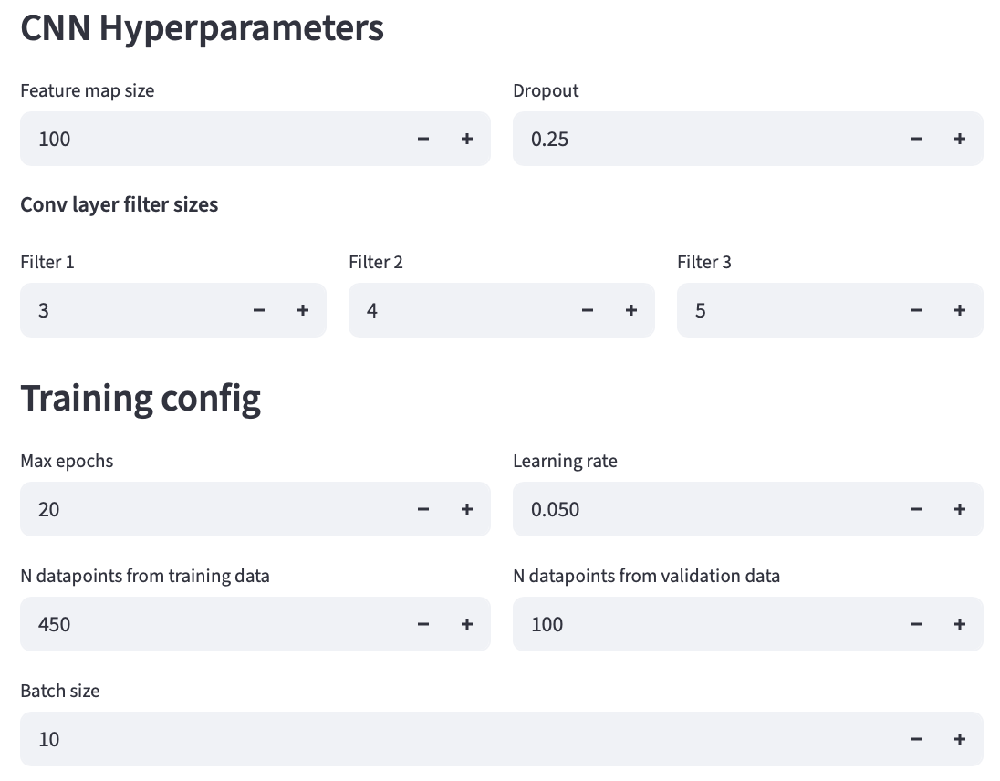
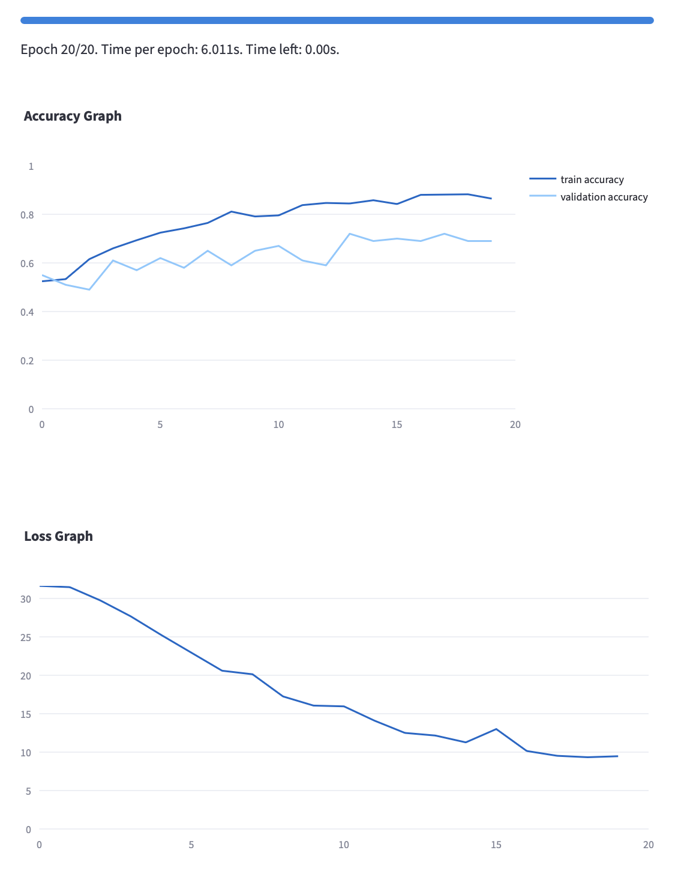
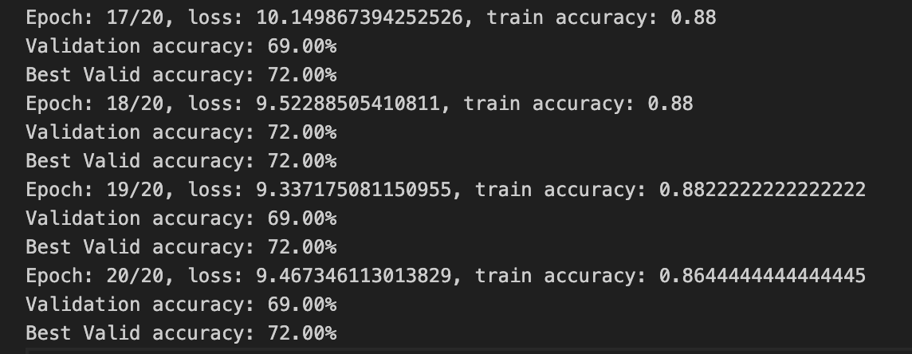
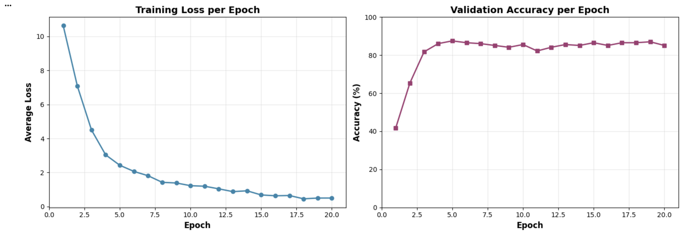
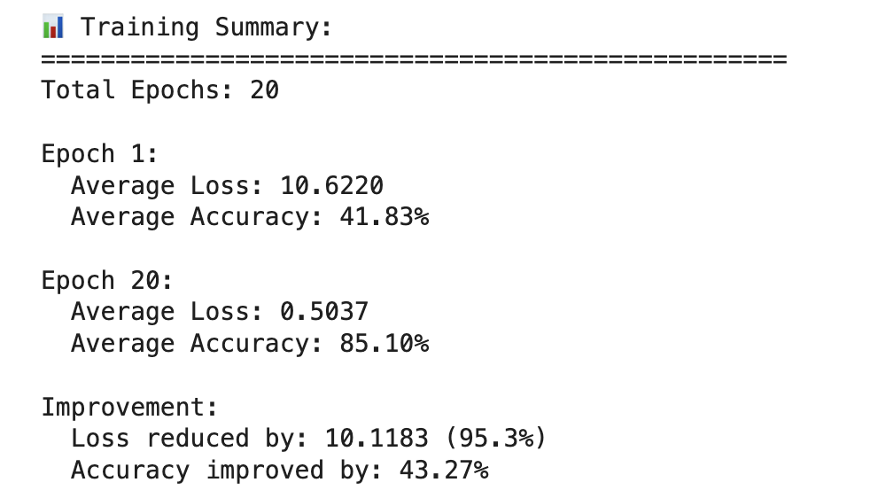
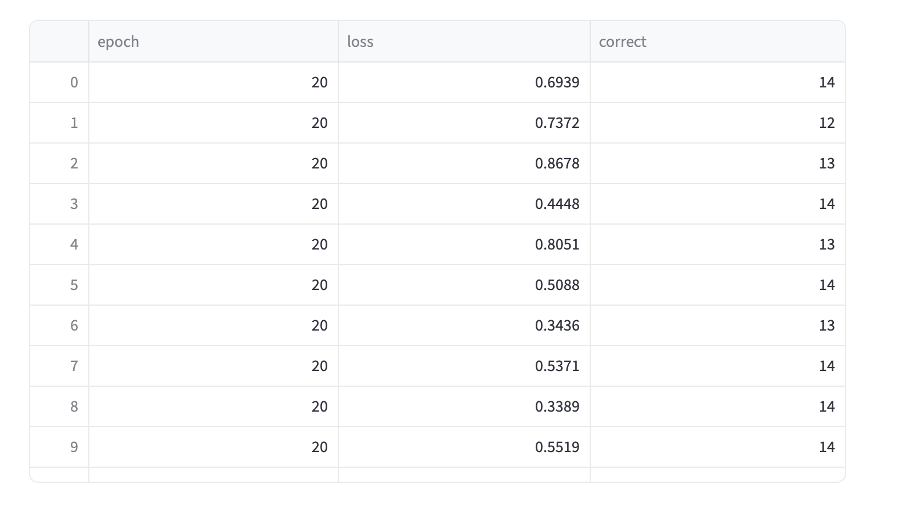

[](https://classroom.github.com/a/Sm5QEMRH)
# MiniTorch Module 4: Neural Networks and Convolutions


<!-- [](https://github.com/minitorch/minitorch/actions) -->
·
* Docs: https://minitorch.github.io

* Overview: https://minitorch.github.io/module4/module4/

Module 4 extends MiniTorch with convolutional neural network operations to build an image recognition system. You'll implement a version of LeNet on MNIST for digit recognition and 1D convolution for NLP sentiment classification:

- **1D and 2D convolution** for feature extraction and image processing
- **Pooling operations** for spatial down-sampling and dimension reduction
- **Advanced NN functions** including softmax, dropout, and max operations
- **MNIST digit classification** and **SST2 sentiment analysis** with CNNs

## Quick Start

```bash
# Install dependencies
pip install -e ".[dev,extra]"

# Set up MNIST dataset
./get_mnist.sh

# Sync files from Module 3
python sync_previous_module.py ../Module-3 .

# Run Module 4 tests
pytest -m task4_1
pytest -m task4_2
pytest -m task4_3
pytest -m task4_4

# Train CNN models
python project/run_mnist_multiclass.py  # MNIST digits
python project/run_sentiment.py         # SST2 sentiment

# Run style checks
pre-commit run --all-files
```

## Tasks Overview

### ✅ Task 4.1: 1D Convolution
**File**: `minitorch/fast_conv.py`
- Implement `_tensor_conv1d()` function
- Support forward and backward convolution with parallel processing

### ✅ Task 4.2: 2D Convolution
**File**: `minitorch/fast_conv.py`
- Implement `_tensor_conv2d()` function
- Optimize for image processing with efficient memory access

### ✅ Task 4.3: Pooling Operations
**File**: `minitorch/nn.py`
- Implement `tile()` tensor reshaping function
- Implement `avgpool2d()` for average pooling

### ✅ Task 4.4: Advanced Neural Network Functions
**File**: `minitorch/nn.py`
- Implement `max()`, `argmax()`, `softmax()`, `logsoftmax()`, and `dropout()`
- Implement `maxpool2d()` for max pooling operations
- Add property tests and ensure gradient computation correctness

### Task 4.4b: Extra Credit (CUDA Convolution)
**File**: `minitorch/cuda_conv.py` (Create this file)
- Implement `conv1d` and `conv2d` on CUDA for efficient GPU processing
- Critical for large-scale image recognition performance
- Show output on Google Colab

### ✅ Task 4.5: Training an Image Classifier
**Files**: `project/run_sentiment.py` and `project/run_mnist_multiclass.py`
- Implement Conv1D, Conv2D, and Network for both sentiment and image classification
- Train models on SST2 sentiment data and MNIST digit classification
- Use Streamlit visualization to view hidden states of your model

**Training Requirements:**
- 👌🏻 Train a model on Sentiment (SST2), add training logs as `sentiment.txt` showing train loss, train accuracy and validation accuracy (should achieve >70% best validation accuracy)
- 👌🏻 Train a model on Digit classification (MNIST), add logs as `mnist.txt` showing train loss and validation accuracy
- 👌🏻 Implement Conv1D, Conv2D, and Network classes for both training files
---
### SST2 Sentiment Classification Report
#### Hyperparameters


#### Log and Accuracy Graph


#### Training Results
- **Validation accuracy: 69.00%**
- **Best Valid accuracy: 72.00%**

#### Training Logs
Full logs: [sst2.txt](log/sst2_training_log.txt)




### MNIST Digit Classification Report
#### Hyperparameters
- Number of training samples: 1,000
- Batch size: 16
- Learning rate: 0.01
- Number of epochs: 20

#### Log and Accuracy Graph


#### Training Results (Performance Summary)
- **Final Accuracy**: 85.10% (14/16)
- **Loss Reduction**: 10.62 → 0.50 (Reduce by 10.1183 (95.3%))



#### Training Logs
Full logs: [mnist.txt](log/mnist_training_log.txt)



**Note**: Trained using Google Colab due to local Streamlit issues.😔

## Resources

- **[Installation Guide](installation.md)**: Setup instructions with MNIST
- **[Testing Guide](testing.md)**: CNN testing strategies